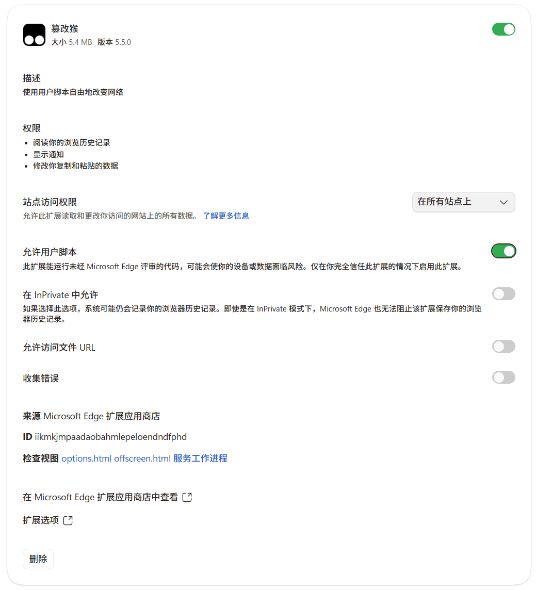

# E-Hentai 原图自动下载脚本

这是一个 Tampermonkey 用户脚本。它只在你已经打开的单张图片页面工作，依次：等待“Download original”链接可用、保存该原图、等待指定间隔、点击当前页码右侧的三角“下一张”。它不会登录、挑选画廊、绕过访问限制或自动发起新画廊任务。

## 安装

1. 在 Chrome/Edge 安装 Tampermonkey 扩展。
2. **Edge 必做：允许用户脚本。** 打开 `edge://extensions`，找到 Tampermonkey 并点击“详细信息”，开启“允许用户脚本”。若未开启，Tampermonkey 虽会显示脚本“已启用”，但脚本不会真正运行在网页中。

   

3. 新建脚本，删除模板内容，将 [`ehentai-original-downloader.user.js`](./ehentai-original-downloader.user.js) 的完整内容粘贴进去并保存。
4. 自行打开已选择好的画廊，并进入任一单张图片页（URL 形如 `https://e-hentai.org/s/...` 或 `https://exhentai.org/s/...`）。
5. 刷新该单张图片页面。右下角会出现“原图自动下载”面板。先将浏览器下载设置设为“不要每次询问保存位置”，然后点击“开始”。

若右下角仍未显示面板，点击 Tampermonkey 图标，再点击 **E-Hentai Original Image Downloader** 这一行，在其菜单中选择“开始原图自动下载”。这是与浮动面板等效的备用入口。

下载文件会放在浏览器的默认下载目录，按画廊标题建立子目录，并以四位序号开头命名。点击“停止”会在当前页面取消后续循环；脚本也会在找不到原图、下载失败或最后一页时自动停止。

> 已安装过旧版脚本时，请完整覆盖为当前版本后再运行。当前版本会精确选择页面右下角的 **Download original** 链接，并按 URL 中的页码定位、点击右侧三角的下一张；连续下载状态保存在同一浏览器标签页中，换页后会自动恢复。页面中“Show galleries with this image”等相邻链接不会被下载。

## 注意

- 默认间隔为 2.5 秒；网络不稳时可调高到 4–6 秒，避免连续请求造成失败。
- 若站点页面改版、某页没有原图，脚本会停止并提示，而不会跳过该页。
- 请只下载你有权访问、保存和使用的内容，并遵守站点规则与当地法律。
